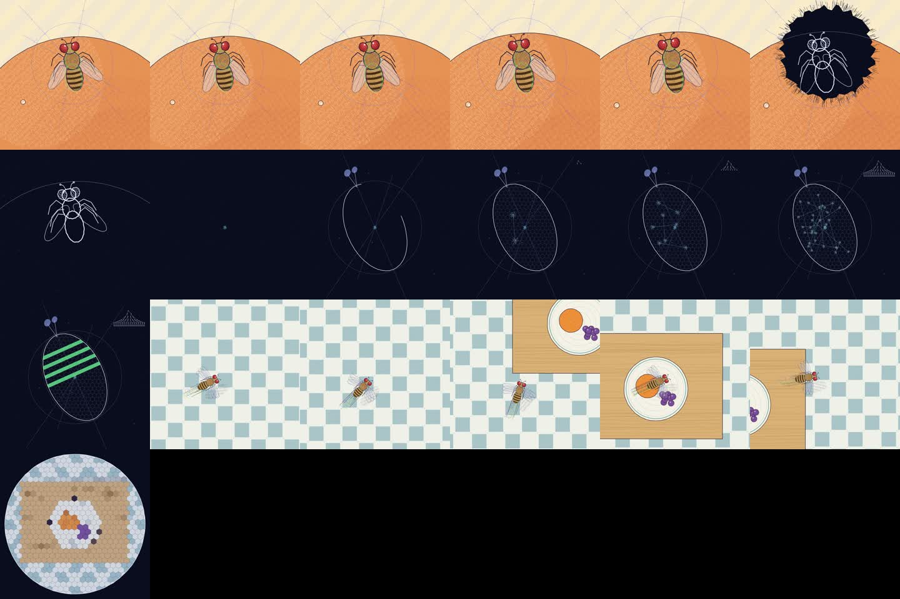

# hand-drawn-canvas-animation

An agent skill for short films that look hand-drawn or hand-printed, where
every frame is drawn by JavaScript on a plain Canvas 2D. One HTML file on top
of a shared core, without images, libraries or a video model. A headless Chrome
screenshots the frames, ffmpeg packs them, and the same file writes the music
from the same timeline, so sound lands on the cuts.


The looks come from four films by Kevin Ngo: [the life of a fruit fly](https://x.com/kevin_t_ngo/status/2099858454043349342),
a [riso flipbook](https://x.com/kevin_t_ngo/status/2099477219877978289),
a [paper boat](https://x.com/kevin_t_ngo/status/2099308402887520495) and
his model's [personal website](https://x.com/kevin_t_ngo/status/2093500169723814093).
I measured each one frame by frame and rebuilt what they share and what they
do differently as one core with a palette system and four finishes.

| look | palette | finish | what it is |
|---|---|---|---|
| ink | `paperInk` | hatching and grain | warm paper, brown fills, construction lines, riso-coloured scribble accents, blueprint interludes on navy |
| riso | `risoPop` | halftone dot screens per ink | cream stock, fluorescent inks overprinted, a seed dot in every frame, ripples, card montages, badge galleries |
| screen | `screenSea` | regular dot grid | flat shapes, sea blues and a cream sky, one protagonist that stays put while the world cuts around it |
| pencil | `pencilMinimal` | thin graphite | cream and charcoal, torn sections, walls of squiggle text, pressed plants, a thread down the page |

Any of them re-colours in one line, with a preset, a preset with overrides, a
hue-shifted derivative, or a duotone. The film is drawn at 12 fps and doubled
to 24, the way cel animation is shot on twos. That cadence does more for the
feel than any texture.

## Files

| path | what it is |
|---|---|
| [`SKILL.md`](SKILL.md) | the procedure the agent follows, the rules, the review checklist |
| [`assets/core.js`](assets/core.js) | the core: colour maths and palettes, four finishes, marks, lattices, motifs, reveals, camera, timeline, score plumbing, player |
| [`assets/film-template.html`](assets/film-template.html) | the file you copy: brief, palette, a puppet, two demo scenes, score |
| [`examples/four-looks.html`](examples/four-looks.html) | a paper boat through riso, screen, pencil and ink, 13.5 s |
| [`examples/fly-style.html`](examples/fly-style.html) | a 9.5 s ink film: peach, ink blot, dividing egg, flight through a kitchen, compound-eye view |
| [`scripts/render.mjs`](scripts/render.mjs) | a 24-frame sheet in seconds, spot frames, format and resolution flags, mp4 and contact sheet, from one headless Chrome |
| [`references/style.md`](references/style.md) | the four looks, fourteen rules, a table from plain words to kit calls |
| [`references/palettes.md`](references/palettes.md) | the palette schema, presets, deriving, tints and shades, finishes and riso plates |
| [`references/scenes.md`](references/scenes.md) | twenty-six scene recipes, timing, score motifs |
| [`references/architecture.md`](references/architecture.md) | file layout, API index, how to build a character, riso plates, pitfalls |
| [`references/brief-template.md`](references/brief-template.md) | the brief the agent fills before writing code |
| [`references/reference-films.md`](references/reference-films.md) | measurements and shot lists of the four films |

## Install

User scope:

```bash
cp -r hand-drawn-canvas-animation ~/.agents/skills/
```

If your agent reads skills from another directory, copy the folder there.
Project scope is `.agents/skills/` inside the repo you work in.

Rendering needs Node 18 or newer, Google Chrome or Chromium, and ffmpeg.
`puppeteer-core` drives the Chrome you already have and downloads nothing.

## Using it

Ask for a film and give it a subject and a look:

> 20 seconds, the life of a request inside a GPU server, riso look, a seed
> dot as the anchor.

The agent writes a beat sheet, picks or derives a palette, renders the style
sheet and palette sheet to check them, builds the characters, draws the
scenes one at a time with single-frame renders, then does a full render and
fixes whatever the contact sheet shows. Rendering by hand:

```bash
mkdir my-film && cp hand-drawn-canvas-animation/assets/core.js my-film/
cp hand-drawn-canvas-animation/assets/film-template.html my-film/my-film.html
cp hand-drawn-canvas-animation/scripts/render.mjs hand-drawn-canvas-animation/scripts/package.json my-film/
cd my-film && npm i
node render.mjs my-film.html --grid 24
node render.mjs my-film.html --ar 9:16 --width 1080
```

The first command writes a sheet of 24 evenly spaced frames in a couple of
seconds; look at it before anything else. The second writes `out/my-film.mp4`
and `out/my-film-contact.jpg`, here as a vertical film. Frames come from the
page's own canvas, not from screenshots, so the output width is a free choice
and the drawing stays crisp at 4K. Scenes draw in logical units with the
short side fixed at 1080 and place things relative to the centre, so one film
renders square, wide or tall. On an M4 Pro the 13.5 s four-looks example
renders in about 5 seconds. A frame that throws is reported with its number
and time, and then no mp4 is built.

Open the HTML file directly in a browser to scrub, play with sound, and export
`score.wav`. Mux it with:

```bash
ffmpeg -i out/my-film.mp4 -i score.wav -c:v copy -c:a aac -shortest out/my-film-final.mp4
```


